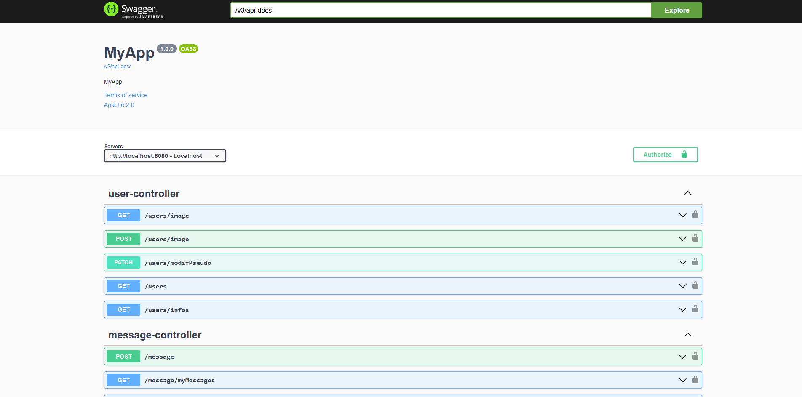

# Partie Back SnapMessaging


# Lancement back

```bash
    mvn spring-boot:run
```


# Test

Un swagger est disponible pour tester les différentes fonctionnalités de l'application à l'adresse http://localhost:8080/swagger-ui/index.html

